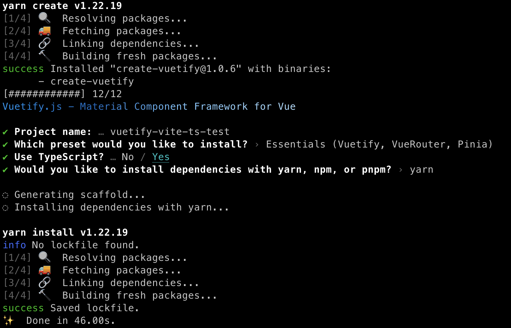
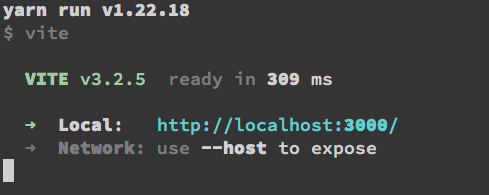
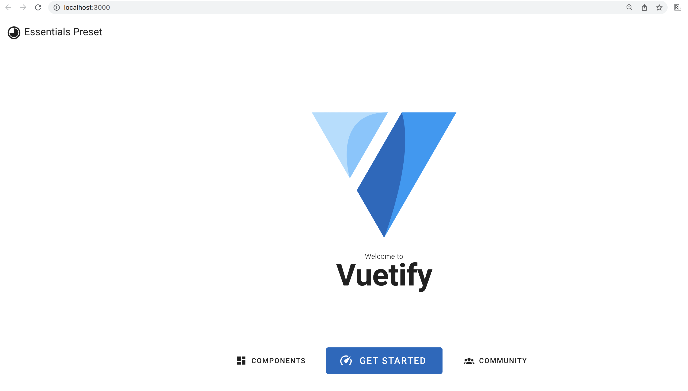
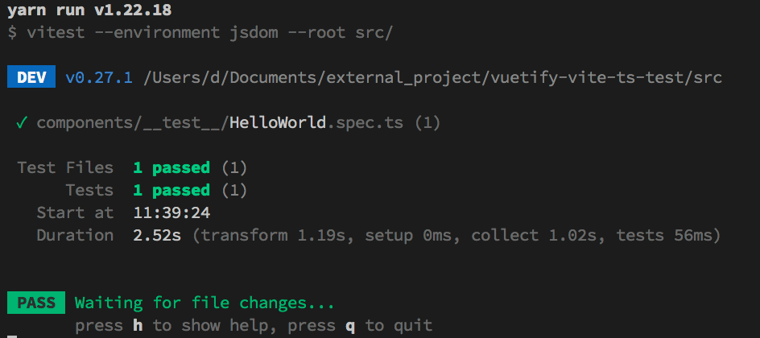
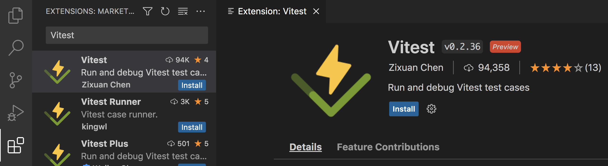
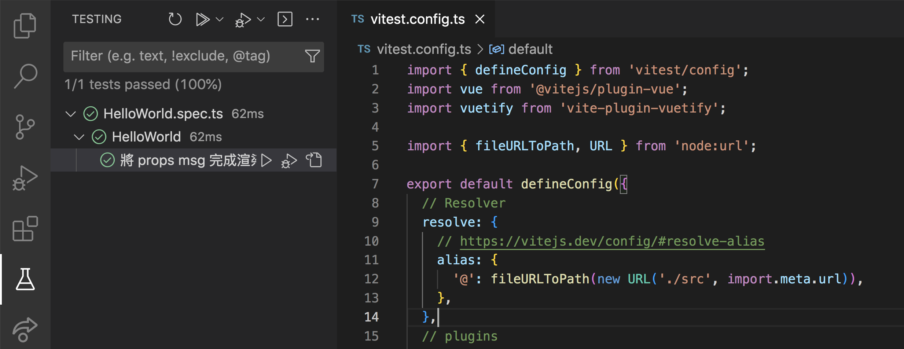

# 在 Vuetify（Vite & TypeScript）中導入單元測試 Unit Testing

> 如果你完全沒有接觸過單元測試，建議可以先閱讀這兩篇文章：「[認識 Jest 測試框架，開始動手寫單元測試](https://medium.com/dean-lin/c61c9f11f844)、[Jest 框架進階應用（describe、Setup and Teardown、Mock function）
](https://medium.com/dean-lin/f9760e2de97e)」。

這篇文章會先帶大家建立 Vuetify 的初始環境（Vue3 & Vite & TypeScript），並導入「Vue Test Utils」這款測試工具。

```
大綱

ㄧ、初始化專案、安裝必要套件
二、編寫測試的 config 檔
三、撰寫第一隻測試程式
四、運行測試程式確認結果符合預期
五、VSCode 的 Vitest 外掛
六、一些建議
```

### ㄧ、初始化專案、安裝必要套件

> 筆者 node.js 的版本為 18.13.0，建議選擇較新的版本，否則安裝套件的過程會遇到一些問題。

這邊我們參考 Vuetify 官方文件的指令 `yarn create vuetify` 來建立專案。

建立過程中會問你很多問題，筆者的選擇如下：
- **Project name**：自行決定（ex：vuetify-vite-ts-test）
- **Which preset would you like to install**：Essentials (Vuetify, VueRouter, Pinia)
- **Use TypeScript**：Yes
- **Would you like to install dependencies with yarn, npm, or pnpm?**：Yarn

> 不過問題時常調整，大家參考就好。


建立好 Vuetify 專案後，我們來安裝測試輔助套件如下：
```
yarn add --dev @vue/test-utils @vitejs/plugin-vue vitest jsdom
```

完成以上步驟後，在終端機輸入指令 `yarn dev`，看看是否能順利啟動。



如果網頁能順利跑出來就恭喜你完成第一步嚕！

### 二、編寫測試的 config 檔

在專案根目錄下，新增 vitest.config.ts，這是專門為了單元測試寫的相關設定檔，你仔細看會發現它跟「vite.config.ts」設定很像。
```ts
import { defineConfig } from 'vitest/config';
import vue from '@vitejs/plugin-vue';
import vuetify from 'vite-plugin-vuetify';

import { fileURLToPath, URL } from 'node:url';

export default defineConfig({
  // Resolver
  resolve: {
    // https://vitejs.dev/config/#resolve-alias
    alias: {
      '@': fileURLToPath(new URL('./src', import.meta.url)),
    },
  },
  // plugins
  plugins: [
    // Vue3
    vue(),
    // Vuetify Loader
    // https://github.com/vuetifyjs/vuetify-loader
    vuetify({
      autoImport: true,
      styles: { configFile: './src/styles/variables.scss' },
    }),
  ],
  test: {
    // https://vitest.dev/guide/#configuring-vitest
    globals: true,
    environment: 'jsdom',
    deps: {
      inline: ['vuetify'],
    },
  },
});
```

### 三、撰寫第一隻測試程式

我們就以入口頁「HelloWorld.vue」為範例跟大家說明。

#### ➤ 調整「src/components/HelloWorld.vue」的程式
這裡我們新增 defineProps 以接收傳進來的「msg」，並在頁面上顯示。
```vue
<template>
  <v-container class="fill-height">
    <v-responsive class="d-flex align-center text-center fill-height">
      <v-img
        contain
        height="200"
        src="@/assets/logo.svg"
      />
      <h1 class="green">{{ msg }}</h1>
    </v-responsive>
  </v-container>
</template>

<script setup lang="ts">
defineProps<{
  msg: string;
}>();
</script>
```

#### ➤ 新增「src/components/__test__/HelloWorld.spec.ts」作為測試程式

在 components 資料夾下建立「 __test__ 」的資料夾放置測試程式，我們透過它來確認 HelloWorld 頁面是否有收到 props 的 msg，並如預期被渲染。
```ts
import { describe, it, expect } from "vitest";
import { mount } from "@vue/test-utils";
import HelloWorld from "../HelloWorld.vue";
import vuetify from '@/plugins/vuetify';
describe("HelloWorld", () => {
  it("renders properly", () => {
    const wrapper = mount(HelloWorld, {
      global: {
        plugins: [vuetify],
      },
      props: {
        msg: "Hello Vitest"
      }
    });
    expect(wrapper.text()).toContain("Hello Vitest");
  });
});
```

### 四、運行測試程式確認結果符合預期

在 package.json 新增一條測試用的 script：`"test:unit": "vitest --environment jsdom --root src/"`
```json
{
  "name": "vuetify-vite-ts-test",
  "version": "0.0.0",
  "private": true,
  "scripts": {
    "dev": "vite",
    "build": "vue-tsc --noEmit && vite build",
    "preview": "vite preview",
    "lint": "eslint . --fix --ignore-path .gitignore",
    "test:unit": "vitest --environment jsdom --root src/"
  },
  "dependencies": {...},
  "devDependencies": {...}
}
```

新增後在終端機輸入指令 `yarn test:unit` 就會開始執行測試，如果看到下面的畫面，就恭喜你成功導入單元測試嚕！



### 五、VSCode 的 Vitest 外掛

跟 Jest 一樣，VSCode 也有 Vite 的外掛喔！他叫做 [Vitest](https://marketplace.visualstudio.com/items?itemName=ZixuanChen.vitest-explorer)。



安裝完成後，點擊 VSCode 左側的「Testing」icon，就可以測試嚕！



### 六、一些建議

#### ➤ VSCode 改使用 Volar 這個外掛

今天這個是以 Vue3 設計的專案，如果你過去 VSCode 使用的版本是 Vue2，那可能有些程式下方會有警告，那可能是 VSCode 過去在 Vue2 時選用 [Vetur](https://marketplace.visualstudio.com/items?itemName=octref.vetur) 這個外掛，現在 Vue3 要改成使用 [Volar](https://marketplace.visualstudio.com/items?itemName=vue.volar)。

#### ➤ 如果遇到了「Type 'Plugin' is not assignable to type 'PluginOption'」這類的錯誤

通常是因為安裝了多個 Vite 的版本所導致的，建議先將根目錄下的「node_modules」以及「.lock」全部移除，然後再重新安裝套件。

> 筆者是在 nvm 切換 node.js 版本時遇到這個問題的。

那今天的文章就分享到這裡，下一篇文章會以實際案例跟大家分享 Vue Test Utils 的應用，敬請期待！